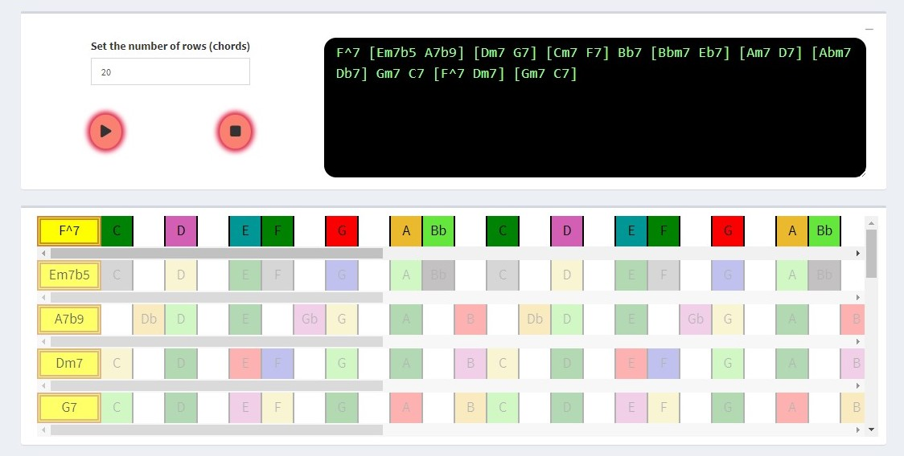
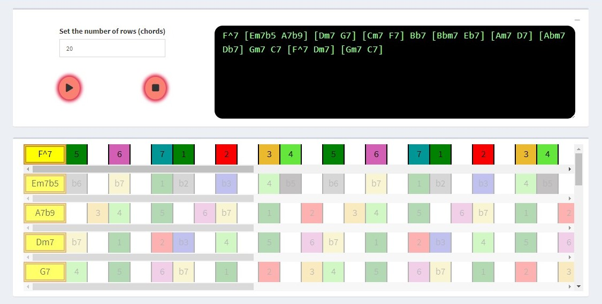

# Who am I?

--

- Mathematics undergraduate from Latin America

--

- Frontend amateur

--

- Shiny enthusiast

--

- .highlight__1[Failed Jazz music player]


---
class: center

# A New Hope

--

<p style="margin-bottom: 20px;"> &nbsp; </p>

<iframe width="560" height="315" src="https://www.youtube.com/embed/-TGIvKZQmGk" title="YouTube video player" frameborder="0" allow="accelerometer; autoplay; clipboard-write; encrypted-media; gyroscope; picture-in-picture; web-share" allowfullscreen>
</iframe>

???
Just show first minute of video.

---

# But ...

--

- .highlight__2[Not free]

--

- .highlight__2[Not for Android]

--

<p style="margin-bottom: 50px;"> &nbsp; </p>

.pull-left[
  # Therefore ...
]

--

.thanos-gif[
<video preload="auto" loop="" autoplay="" width="500" height="300">
<source src="https://media.tenor.com/vCqpL7x4sPUAAAPs/thanos-fine-ill-do-it-myself.webm" type="video/webm">
</video>
]

---
class: center, middle

# [Demo](https://lucio-cornejo.shinyapps.io/jazz-improvisation-app/)

---

# App's basic functionality

<ol id="functionality">
  <li>
    <span>Web scrap chords for popular songs</span>
    <span>Is jazz still popular? :/</span>  
  <li>
    <span>Homogenize chords' notation</span>
    <span>e.g. CM7 = C major 7</span>
  </li>
  <li>
    <span>Detect note played by user</span>
    <span>e.g. using <a href="https://meyda.js.org/">Meyda.js</a></span>
  </li>
  <li>
    <span>Play user selected song</span>
    <span>e.g. using <a href="https://strudel.tidalcycles.org/?C7umG4U5a1Pi">Strudel.js</a></span>
  </li>
  <li>
    <span>Display relationship between selected song and notes played</span>
    <span></span>
  </li>
  <li>
    <span>Allow user to customize music settings</span>
    <span>e.g. choose chords and scales</span>
  </li>
</ol>

---
class: center

# App's main objectives

<p style="margin-bottom: 50px;"> &nbsp; </p>

.highlight__1[
**Facilitate** the user's experience of **creating** a music **solo**.
]

<p style="margin-bottom: 50px;"> &nbsp; </p>

.highlight__1[
**Show** the user each **note's tension evolution**, while the song plays.
]

---
class: middle

## Step 1: Web scraping songs

- Code found [here](https://github.com/lucio-cornejo/jazz-improvisation-app/tree/main/web-scraping) .

- Main library used: `Python`'s [BeautifulSoup](https://pypi.org/project/beautifulsoup4/).

- Main database used: [The Jazzomat Research Project](https://jazzomat.hfm-weimar.de/dbformat/dbcontent.html) .

- Final [result](https://github.com/lucio-cornejo/jazz-improvisation-app/blob/main/data/web-scrapped-chord-progressions.json) .

---
class: middle

## Step 2: Homogenize chords' notation

- Chord notation [translation](https://github.com/lucio-cornejo/jazz-improvisation-app/blob/main/data/chord-types-translator.json) used .

- [Code](https://github.com/lucio-cornejo/jazz-improvisation-app/blob/main/chord-types/02-translate-chord-types.js) for chord translation .

---
class: middle

## Step 3: Detect note played by user

- `ml5.js`'s note detection module is used.

- [Code](https://github.com/lucio-cornejo/jazz-improvisation-app/blob/main/www/js-main-or-modules/embed-ml5.js)
where `ml5.js` is imported.

- The code for the note detection should be kept isolated,
so that it is easy to replace the tool for note detection
([Pitchy.js](https://github.com/ianprime0509/pitchy), Meyda.js, etc).

---
class: middle

## Step 4: Play user selected song

- `Strudel.js` is being used to produce sound.

- [Code](https://github.com/lucio-cornejo/jazz-improvisation-app/blob/main/www/js-main-or-modules/embed-Strudel.js)
where `Strudel.js` is imported.

- The code for song playing should also be kept isolated, 
for ease of replacement, for example, using [Tone.js](https://tonejs.github.io/).

---
class: middle

## Step 5: Display relationship between selected song and notes played

- At this step, `Shiny` and basic frontend knowledge comes most in handy.

- Examples:

.pull-left[
```{r}
#| echo: false
#| fig.cap: "Musical notes"
#| fig.align: center

```
]

--

.pull-right[
```{r}
#| echo: false
#| fig.cap: "Musical degrees"
#| fig.align: center

```
]

---
class: middle

## Step 6: Allow user to customize music settings

- [Code](https://github.com/lucio-cornejo/jazz-improvisation-app/blob/main/www/js/00-02-choose-degree-colors.js) for changing musical degree colors.

- [Code](https://github.com/lucio-cornejo/jazz-improvisation-app/blob/main/www/js/00-05-toggle-notes-degrees.js) for toggle between musical note or degree.

- [Code](https://github.com/lucio-cornejo/jazz-improvisation-app/blob/main/www/js/00-06-download-music-data.js) for saving the app's music settings (chosen scales and chords).

- [Code](https://github.com/lucio-cornejo/jazz-improvisation-app/blob/main/www/js/00-07-upload-music-data.js) for uploading the same type of file, to set the app's music settings (does not work yet).

- [Code](https://github.com/lucio-cornejo/jazz-improvisation-app/blob/main/www/js/01-01-root-scale-voicing-selections.js) for updating
the root and scale of a single row of notes (chord change via dropdown menu does not work yet).

- [Code](https://github.com/lucio-cornejo/jazz-improvisation-app/blob/main/www/js/02-05-update-chords-cells-via-Strudel.js) for updating
the chords (and notes rows) via a text area, using `Strudel.js` (does not fully work yet).

---

<p style="margin-bottom: -80px;"> &nbsp; </p>

# Future goals

- Make app work in mobile (note detection fails so far).

- Change the app's code structure into a package,
as in `golem` fashion.

- Make the app downloadble, so that the user can execute
it more smoothly in their own machine (maybe using an `R` import of [Electron.js](https://www.electronjs.org/)).

- Expand the number of songs in the database.

- Expand the number of scales and chords in the database.

- Incorporate AI into the app, for example, as [Google's AI duet](https://experiments.withgoogle.com/ai/ai-duet/view/).

- Being able to record the user's notes played and download it as a MIDI file.

- Output an analysis of the musical solo played by the 
user, once the recording started.

- User inputs a MIDI file consisting of only notes from a musical solo (for example, from a piano recording) and the app can show, sequentially, the notes played, using the app's rows of notes.

---
class: middle, center

# Everyone is welcome to help in this project

<https://github.com/lucio-cornejo/jazz-improvisation-app>

--

<p style="margin-bottom: 75px;"> &nbsp; </p>

# Thank you!
